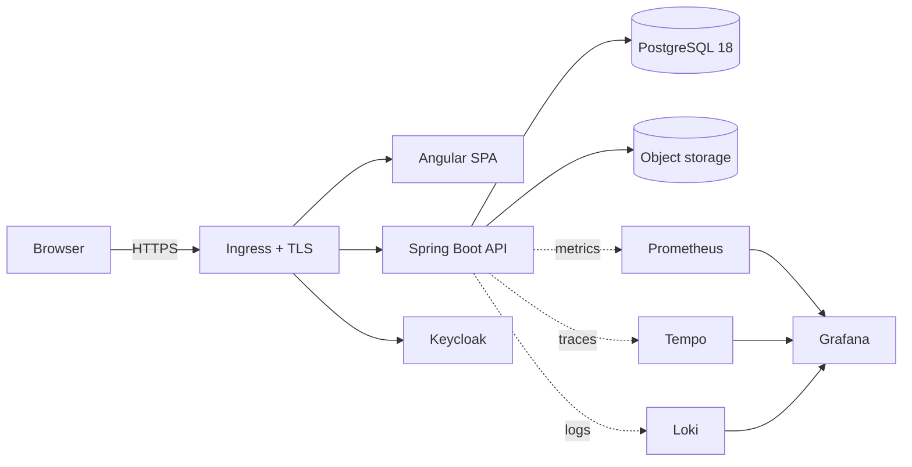

# AssetCare: a production-ready Angular + Spring Boot reference application

**What is this?** A complete, working asset-maintenance manager (AssetCare) built the way a serious application is
built inside a bank, an insurer or a large company: one Angular 22 SPA, one Spring Boot 4.1 service on Java 25,
PostgreSQL 18 with Liquibase, Keycloak for identity, OpenTelemetry observability, tests at every level, multi-arch
containers, a Helm chart, GitHub Actions, and a free Kubernetes deployment on Oracle Cloud.

**Why does it exist?** So that you do not spend your first two weeks on a new project figuring out logging,
authentication, migrations, Docker, Kubernetes, monitoring, testing and CI/CD. Clone it, run it, read why each piece is
there, and evolve it. It is also the reference project for the [Janaka Academy](https://janaka.me/academy/) course
*From CRUD to Production*, told as a seven-course meal.

**What will I learn?** Clean architecture with enforced boundaries, optimistic locking and idempotency, Problem
Details errors, OIDC with PKCE and a resource server, structured logs correlated with traces and metrics, Testcontainers,
ArchUnit, Playwright, k6, non-root multi-arch images, Helm, K3s, TLS with cert-manager, backup and restore, and the
honest difference between a free reference deployment and an enterprise platform.



## Status

This repository is being built course by course. The table is updated at the end of each course and only lists what
has been executed.

| Course | State |
|---|---|
| 1 Mise en place: architecture, domain, standards, environment | done |
| 2 Starter: PostgreSQL schema and migrations | in progress |
| 3 Soup: Spring Boot service | not started |
| 4 Main course: Angular application | not started |
| 5 Side dishes: quality, security, reliability | not started |
| 6 Dessert: observability | not started |
| 7 Coffee: deployment, CI/CD, operations | not started |

## How do I run it?

Requirements: Java 25, Node 24 or newer, Docker with Compose v2. `make doctor` checks.

```bash
git clone https://github.com/Janaka2/spring-angular-production-blueprint.git
cd spring-angular-production-blueprint
cp .env.example .env          # development credentials, labelled as such
docker compose up -d --wait   # PostgreSQL 18, Keycloak 26 with the assetcare realm, MinIO
make backend                  # API on http://localhost:8080
make frontend                 # SPA on http://localhost:4200  (second terminal)
```

| What | URL | Credentials (development only) |
|---|---|---|
| Angular SPA | http://localhost:4200 | `alice` / `alice-dev-password` (USER), `admin` / `admin-dev-password` (ADMIN), `audrey` / `audrey-dev-password` (AUDITOR) |
| API | http://localhost:8080/api/v1 | bearer token from Keycloak |
| OpenAPI UI | http://localhost:8080/swagger-ui.html | |
| Health | http://localhost:8080/actuator/health | |
| Keycloak admin | http://localhost:8081 | `admin` / `admin-dev-password` |
| MinIO console | http://localhost:9001 | `assetcare` / `assetcare-dev-password` |
| Grafana (observability profile) | http://localhost:3000 | `admin` / `admin` |

## How do I test it?

```bash
make unit-test          # backend unit tests, no Docker
make integration-test   # backend against PostgreSQL 18 in Testcontainers
make test               # backend unit tests + frontend tests
make e2e                # Playwright against the running stack
```

## How do I deploy it?

See `docs/operations/DEPLOYMENT.md` (Helm on any Kubernetes) and `docs/operations/OCI-FREE-TIER.md` (K3s on an OCI
Always Free ARM VM with TLS from Let's Encrypt). `make helm-lint` and `make helm-template` validate the chart.

## How do I monitor it?

`make observability` starts Prometheus, Grafana, Loki, Tempo and the OpenTelemetry Collector. Grafana dashboards and
alert rules are in `observability/` and checked into Git. See `docs/operations/OBSERVABILITY.md`.

## How do I extend it?

Read `docs/architecture/ARCHITECTURE.md` for the dependency direction and where a new feature goes, then
`docs/CODING-STANDARDS.md` and `docs/DEFINITION-OF-DONE.md`. Decisions that constrain you are in `docs/adr/`.

## Documentation map

- `docs/architecture/` — architecture, domain model, Oracle migration
- `docs/adr/` — architecture decision records
- `docs/operations/` — deployment, OCI free tier, runbook, backup and restore, scaling, observability
- `docs/security/` — security principles, threat model
- `docs/PRODUCTION-GAPS.md` — what an enterprise replaces
- `docs/academy/` — the seven-course roadmap and the Academy article
- `VERSION-MATRIX.md` — every version, verified against its official source

## Verification report

Updated at the end of each course. Only executed checks are marked PASS.

```text
Backend compile (Java 25, Spring Boot 4.1.1)     PASS   (2026-09-16, local, ./mvnw compile)
Frontend build (Angular 22.1)                    PASS   (2026-09-16, local, ng build)
Frontend unit tests (Vitest)                     PASS   (2026-09-16, local, 2 tests)
Backend unit tests                               NOT EXECUTED (course 3)
Integration tests (Testcontainers)               NOT EXECUTED (course 3, CI)
Docker build amd64 / arm64                       NOT EXECUTED (course 7, CI)
Helm lint / template                             NOT EXECUTED (course 7)
Security scans                                   NOT EXECUTED (course 5, CI)
E2E (Playwright)                                 NOT EXECUTED (course 4/5, CI)
OCI deployment                                   NOT EXECUTED
Smoke test                                       NOT EXECUTED
```

## Licence

Apache-2.0. See `LICENSE`.
