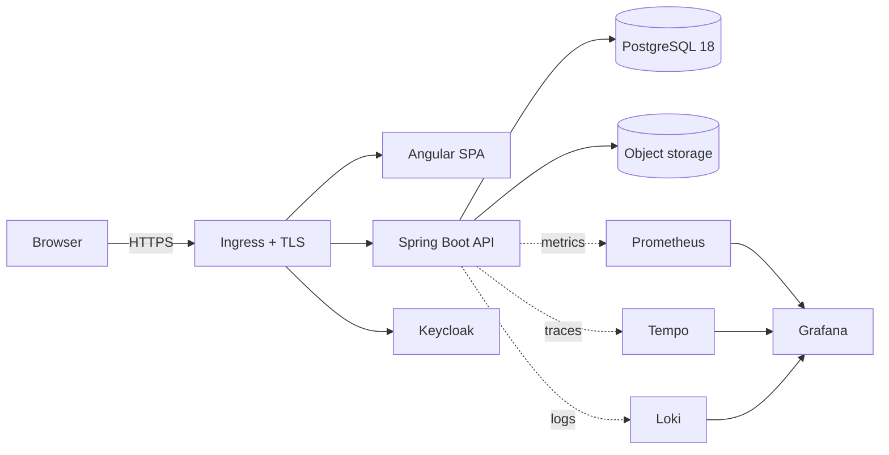

# AssetCare: a production-ready Angular + Spring Boot reference application

**What is this?** A complete, working asset-maintenance manager (AssetCare) built the way a serious application is
built inside a bank, an insurer or a large company: one Angular 22 SPA, one Spring Boot 4.1 service on Java 25,
PostgreSQL 18 with Liquibase, Keycloak for identity, OpenTelemetry observability, tests at every level, multi-arch
containers, a Helm chart, GitHub Actions, and a Kubernetes deployment on one small Hetzner Cloud server (CX33).

**Why does it exist?** So that you do not spend your first two weeks on a new project figuring out logging,
authentication, migrations, Docker, Kubernetes, monitoring, testing and CI/CD. Clone it, run it, read why each piece is
there, and evolve it. It is also the reference project for the [Janaka Academy](https://janaka.me/academy/) course
*From CRUD to Production*, told as a seven-course meal.

**What does the UI do?** Dashboard with status tiles and due work; assets with search, filters, sort and paging kept
in the URL, CSV export, create, edit with conflict detection, drafts and unsaved-change protection; detail with
maintenance planning and rescheduling, service history, attachments with image preview, and the audit trail; category
administration; settings for theme, density and defaults; keyboard shortcuts; offline and new-version notices;
accessible and phone-ready. `docs/architecture/UI-WIREFRAMES.md` shows every screen.

**What will I learn?** Clean architecture with enforced boundaries, optimistic locking and idempotency, Problem
Details errors, OIDC with PKCE and a resource server, structured logs correlated with traces and metrics, Testcontainers,
ArchUnit, Playwright, k6, non-root multi-arch images, Helm, K3s, TLS with cert-manager, backup and restore, and the
honest difference between a free reference deployment and an enterprise platform.



## Status

This repository is being built course by course. The table is updated at the end of each course and only lists what
has been executed.

| Course | State |
|---|---|
| 1 Mise en place: architecture, domain, standards, environment | done |
| 2 Starter: PostgreSQL schema and migrations | done |
| 3 Soup: Spring Boot service | done (integration tests pass locally and run in `ci`) |
| 4 Main course: Angular application | done (Playwright passes locally against the production image; runs in `ci`) |
| 5 Side dishes: quality, security, reliability | done (SBOM, restore drill, Trivy and gitleaks pass locally; CodeQL runs only on GitHub) |
| 6 Dessert: observability | done (stack starts with `make observability`) |
| 7 Coffee: deployment, CI/CD, operations | v1.0.0 released: signed multi-arch images on GHCR, chart on the GitHub release; production trial on one Hetzner CX33 (ADR-012) |
| Academy article | done: [janaka.me/academy/production-ready-spring-angular](https://janaka.me/academy/production-ready-spring-angular/) (source: `docs/academy/ARTICLE.md`) |

## Look and feel

A calm, minimal interface in the style of current product tools: a sidebar with a **⌘K / Ctrl K command menu** (jump
to any page, run an action, find an asset by name, tag or serial), Inter and Material Symbols, status pills, skeleton
loading instead of spinners, an agenda-style dashboard, and a first-class dark mode. It works at phone width and passes
the accessibility lint rules.

It is built to be reused. Every colour, radius, shadow and font is a token in `frontend/src/styles.scss`, and Angular
Material components read those tokens, so a project started from this template rebrands by editing the first block of
that file and `frontend/public/icons/icon.svg`. The reusable building blocks are in `frontend/src/app/shared/`:
`state.ts` (skeleton, empty, error), `format.ts` (labels, tones, dates) and the global `.card`, `.pill`, `.tile-icon`,
`.row` and `.fields` classes.

## Try the live demo

https://assetcare.janaka.me: sign in as **`demo`** / **`AssetCare-Demo-2026`**. This is a deliberately public, shared
account (USER role only) holding the Keller household's showcase data: 15 assets across every category and status,
overdue and upcoming maintenance, service history and attachments. Other visitors see the same data and can change it.
The data is loaded through the API by `scripts/seed-demo.sh` from `scripts/demo-data/showcase.json`; RUNBOOK
"Demo data" explains how to seed and reset it.

## How do I run it?

Requirements: Java 25, Node 24, Docker with Compose v2. `make doctor` checks. Never done this before? `docs/ENVIRONMENT-SETUP.md` starts from
zero (what a terminal is) and takes you to a running local copy (L1 to L12) and to production (P1 to P14), checking
after every step. Then `docs/operations/OPERATIONS-GUIDE.md` explains how to keep it running.

```bash
git clone https://github.com/Janaka2/spring-angular-production-blueprint.git
cd spring-angular-production-blueprint
cp .env.example .env          # development credentials, labelled as such
docker compose up -d --wait   # PostgreSQL 18, Keycloak 26 with the assetcare realm, MinIO
make backend                  # API on http://localhost:8080
make frontend                 # SPA on http://localhost:4200  (second terminal)
```

| What | URL | Credentials (development only) |
|---|---|---|
| Angular SPA | http://localhost:4200 | `alice` / `alice-dev-password` (USER), `admin` / `admin-dev-password` (ADMIN), `audrey` / `audrey-dev-password` (AUDITOR) |
| API | http://localhost:8080/api/v1 | bearer token from Keycloak |
| OpenAPI UI | http://localhost:8080/swagger-ui.html | |
| Health | http://localhost:8080/actuator/health | |
| Keycloak admin | http://localhost:8081 | `admin` / `admin-dev-password` |
| MinIO console | http://localhost:9001 | `assetcare` / `assetcare-dev-password` |
| Grafana (observability profile) | http://localhost:3000 | `admin` / `admin` |

## How do I test it?

```bash
make unit-test          # backend unit tests, no Docker
make integration-test   # backend against PostgreSQL 18 in Testcontainers
make test               # backend unit tests + frontend tests
make e2e                # Playwright against the running stack
```

## How do I deploy it?

See `docs/ENVIRONMENT-SETUP.md` steps P1 to P14 (K3s on one Hetzner Cloud CX33 created by `infra/hetzner`, TLS from
Let's Encrypt; ADR-012) and `docs/operations/DEPLOYMENT.md` (Helm on any Kubernetes). `make helm-lint` and
`make helm-template` validate the chart.

## How do I monitor it?

`make status` (or `scripts/health.sh k8s assetcare` on a cluster) prints a one-screen health summary that names the
runbook section for anything failing. `make observability` starts Prometheus, Alertmanager, the blackbox exporter,
Grafana, Loki, Tempo and the OpenTelemetry Collector. Dashboards and alert rules are in `observability/` and checked
into Git. What healthy means, the SLOs and the alert-to-runbook map: `docs/operations/HEALTH-MONITORING.md`.

## How do I extend it?

Read `docs/architecture/ARCHITECTURE.md` for the dependency direction and where a new feature goes, then
`docs/CODING-STANDARDS.md` and `docs/DEFINITION-OF-DONE.md`. Decisions that constrain you are in `docs/adr/`.

## Documentation map

- `docs/ENVIRONMENT-SETUP.md` — setup from zero, local and production, written for beginners; each step verified
- `docs/operations/OPERATIONS-GUIDE.md` — keeping it running, in plain language; `RUNBOOK.md` is the expert version
- `docs/PATH-TO-PRODUCTION.md` — every activity from clone to a smoothly running, changeable system, with its proof and honest status
- `docs/HOW-TO-MODIFY.md` — the playbook for common changes; the same playbook as AI skills in `.claude/skills/`
- `docs/architecture/` — architecture, domain model, database model (ER diagram, every column and index), UI wireframes (every screen, state and role), Oracle migration
- `docs/adr/` — architecture decision records
- `docs/operations/` — deployment, runbook, health monitoring, backup and restore, scaling, observability, post-mortem template
- `docs/security/` — security principles, threat model
- `docs/PRODUCTION-GAPS.md` — what an enterprise replaces
- `docs/academy/` — the seven-course roadmap and the Academy article
- `docs/TOOLS-AND-LIBRARIES.md` — every tool and library, what it does here and what it makes easy
- `VERSION-MATRIX.md` — every version, verified against its official source

## Verification report

Updated at the end of each course. Only executed checks are marked PASS.

```text
Executed on 2026-09-23 (WSL2 Ubuntu, Docker 29.8, Java 25.0.2, Node 24.21), main after the Dependabot merges:
Backend unit + architecture tests                   PASS   23 tests, including 4 ArchUnit rules
Integration tests (Testcontainers, PostgreSQL 18.6) PASS   4 tests; changelog applies, Hibernate validate accepts it
Frontend lint + format, unit tests, production build PASS  21 tests; Angular 22.1.7, TypeScript 6.0.3
E2E (Playwright, real Keycloak + API + SPA)         PASS   7 of 7, two consecutive runs
API smoke over all four demo roles                  PASS   51 checks: CRUD, If-Match/409, idempotency, roles,
                                                           maintenance, attachments via MinIO, archive/restore
Browser console on every screen, three roles        PASS   no console or page errors
Backup → damage → restore drill (make backup/restore) PASS  checksum ok, row counts of six tables identical
Docker builds, local platform (amd64)               PASS   api 652 MB as uid 10001; frontend 84 MB as uid 101
API image with production settings                  PASS   prod Liquibase context, no demo data, S3 storage,
                                                           HSTS behind TLS, 409 on duplicate tag
Helm lint + template, core values                   PASS   every third-party image checked pullable (arm64 incl.)
Trivy fs (dependencies, config) and both images     PASS   after the Tomcat 11.0.26 override; no fixable critical CVE
gitleaks, full history                               PASS   one reviewed false positive allowlisted in .gitleaks.toml
Terraform fmt + validate (infra/hetzner)             PASS   2026-09-23, Terraform 1.16.3, hcloud 1.69.0; cloud-init renders
actionlint (with shellcheck) on the three workflows  PASS
Production frontend image, e2e + console, real CSP   PASS   7 of 7; zero CSP violations after two fixes (headers, critical CSS)
Docker builds arm64, CodeQL, cosign, release         NOT EXECUTED; they run on GitHub (ci, security, release workflows)

Executed by the author (2026-09-16, macOS, no Docker daemon available):
Backend compile (Java 25, Spring Boot 4.1.1)        PASS   ./mvnw compile
Backend unit + architecture tests                   PASS   23 tests: domain, use cases, health, ArchUnit
Frontend build (Angular 22.1)                       PASS   ng build, 559 kB initial, under budget
Frontend lint + format (angular-eslint, Prettier)   PASS
Frontend unit tests (Vitest)                        PASS   21 tests
Helm lint (Helm 4.3.0)                              PASS   0 charts failed
Helm template, core values                          PASS   19 objects rendered
Helm template, enterprise values (external DB/IdP/  PASS   10 objects rendered, no development password in output
  object storage, existingSecret, HPA, ServiceMonitor)
Version matrix                                      PASS   every version checked against its official source

GitHub Actions (.github/workflows): ci run 35845269250 and security run 35845269122 PASS on 2026-09-23; release v1.0.0 run 35849250614 PASS (linux/amd64 + linux/arm64, cosign verify and SBOM attestation verify pass). The lines below are the author's earlier record:
Integration tests (Testcontainers, PostgreSQL 18)   NOT EXECUTED locally; job backend
Backup → wipe → restore drill                       NOT EXECUTED locally; job backup-restore
E2E (Playwright, real Keycloak + API + SPA)         NOT EXECUTED locally; job e2e
Docker builds amd64/arm64, config.json render check NOT EXECUTED locally; jobs images (ci) and images (release)
Trivy (fs, images), CodeQL, dependency review,      NOT EXECUTED locally; workflow security
  gitleaks
k6 load test                                        NOT EXECUTED; scripts and thresholds in performance/
Observability stack with real traffic               NOT EXECUTED; docker-compose.observability.yml validated in CI

Not executed anywhere yet:
Hetzner CX33 + K3s installation, DNS, TLS issuance  NOT EXECUTED yet; ENVIRONMENT-SETUP.md P4-P14, a check per step
Smoke test against a deployed instance              NOT EXECUTED; scripts/smoke-test.sh runs in the e2e job against localhost
```

## Licence

Apache-2.0. See `LICENSE`.
