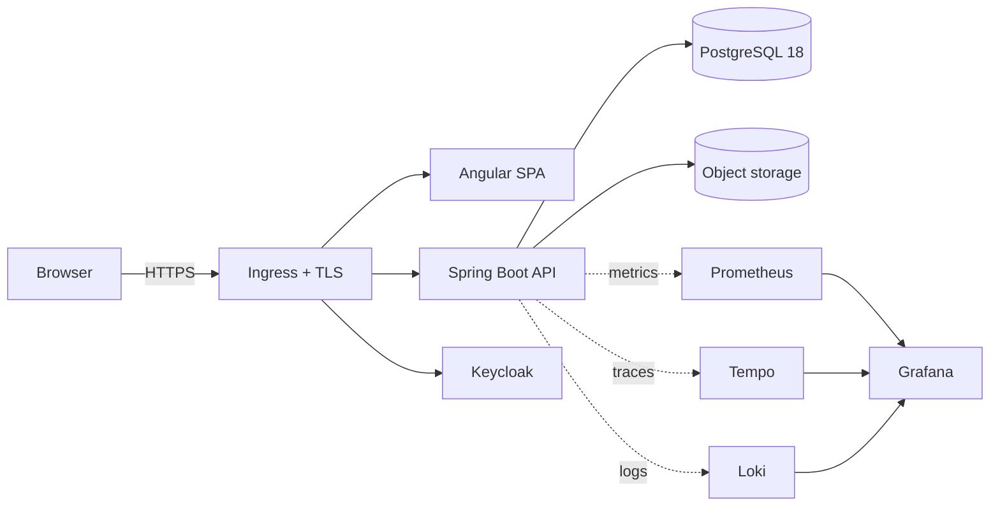

# AssetCare

**A production-grade asset-maintenance application, designed, built, tested, deployed and operated end to end by
[Janaka Premathilaka](https://janaka.me).**

One Angular 22 SPA, one Spring Boot 4.1 service on Java 25, PostgreSQL 18 with Liquibase, Keycloak for identity,
OpenTelemetry observability, tests at every level, signed multi-arch containers, a Helm chart, GitHub Actions, and a
Kubernetes deployment running in production today.

**[▶ Try the live demo](https://assetcare.janaka.me)** · **[Read the article](https://janaka.me/academy/production-ready-spring-angular/)** · **[Request source access](ACCESS.md)**

      

> **This is a showcase, not the source.** The full codebase is private. This repository holds the architecture, the
> decisions behind it, screenshots and a few hand-picked code excerpts, all under a
> [view-only license](LICENSE). Nothing here is buildable on its own. For access to the full source, see
> [ACCESS.md](ACCESS.md).

## Try it

**https://assetcare.janaka.me**: sign in as **`demo`** / **`AssetCare-Demo-2026`**. This is a shared, public account
(USER role) with showcase data: 15 assets in every category and status, overdue and upcoming maintenance, service
history and attachments. Other visitors see the same data.

<!-- TODO: restore when assets/screenshots/*.png are added
## Screenshots

| Dashboard | Assets |
|---|---|
|  |  |
| **Asset detail** | **⌘K command menu** |
|  |  |
| **Dark mode** | **Phone** |
|  |  |
-->

## What it does

- **Dashboard** with status tiles and an agenda of due and overdue maintenance.
- **Assets** with search, filters, sorting and paging kept in the URL, CSV export, create and edit with conflict
  detection, drafts, and protection against losing unsaved changes.
- **Asset detail** with maintenance planning and rescheduling, service history, attachments with image preview, and
  the full audit trail.
- **Roles**: user, admin and auditor, enforced by the API and reflected in the UI.
- **⌘K / Ctrl K command menu**, keyboard shortcuts, dark mode, density settings, offline and new-version notices,
  accessible and phone-ready.

## Architecture

```mermaid
flowchart LR
    U[Browser] -->|HTTPS| ING[Ingress + TLS]
    ING --> FE[Angular SPA]
    ING --> API[Spring Boot API]
    ING --> KC[Keycloak]
    API --> PG[(PostgreSQL 18)]
    API --> OBJ[(Object storage)]
    API -.metrics.-> PROM[Prometheus] --> GRAF[Grafana]
    API -.traces.-> TEMPO[Tempo] --> GRAF
    API -.logs.-> LOKI[Loki] --> GRAF
```

- **Clean architecture with enforced boundaries.** Domain, application, adapters and infrastructure, with the
  dependency direction checked by ArchUnit on every build ([excerpt](excerpts/backend/tests/ArchitectureTest.java)).
- **Correct under concurrency and retries.** Optimistic locking with `If-Match` / `409`, and `Idempotency-Key`
  support on creates ([excerpt](excerpts/backend/application/AssetService.java)).
- **Standards-based errors and security.** RFC 9457 Problem Details, OIDC Authorization Code + PKCE in the SPA, a JWT
  resource server in the API, per-aggregate authorization.
- **Observable.** Structured logs correlated with traces and metrics through OpenTelemetry; Grafana dashboards, SLOs
  and alert rules kept in Git.
- **Shipped like a real product.** Non-root multi-arch images signed with cosign plus an SBOM attestation, a Helm
  chart, K3s with cert-manager TLS on Hetzner Cloud, Terraform for the server, and a tested backup-and-restore drill.

Read more: [architecture](docs/architecture/ARCHITECTURE.md) · [domain model](docs/architecture/DOMAIN-MODEL.md) ·
[UI wireframes](docs/architecture/UI-WIREFRAMES.md) · [security principles](docs/security/SECURITY-PRINCIPLES.md) ·
[tools and libraries](docs/TOOLS-AND-LIBRARIES.md) · [production gaps](docs/PRODUCTION-GAPS.md)

## Decisions

Every significant choice is recorded as an Architecture Decision Record, with the options considered and what was
given up:

| ADR | Decision |
|---|---|
| [001](docs/adr/ADR-001-postgresql-for-the-reference-deployment.md) | PostgreSQL for the reference deployment, Oracle as a documented migration |
| [002](docs/adr/ADR-002-one-modular-service-before-microservices.md) | One modular service before microservices |
| [003](docs/adr/ADR-003-keycloak-for-identity.md) | Keycloak for identity |
| [004](docs/adr/ADR-004-k3s-on-oci-free-tier.md) | K3s on the OCI free tier (superseded by 012) |
| [005](docs/adr/ADR-005-liquibase-for-schema-migration.md) | Liquibase for schema migration |
| [006](docs/adr/ADR-006-opentelemetry-observability.md) | OpenTelemetry observability |
| [007](docs/adr/ADR-007-object-storage-for-attachments.md) | Object storage for attachments |
| [008](docs/adr/ADR-008-angular-oauth2-oidc.md) | angular-oauth2-oidc in the SPA |
| [009](docs/adr/ADR-009-angular-state-without-ngrx.md) | Angular state with signals, without NgRx |
| [010](docs/adr/ADR-010-archive-instead-of-delete.md) | Archive instead of delete |
| [011](docs/adr/ADR-011-jpa-annotations-on-domain-entities.md) | JPA annotations on domain entities |
| [012](docs/adr/ADR-012-k3s-on-hetzner-cx33.md) | K3s on one Hetzner Cloud CX33 |

## Code excerpts

A few files, chosen to show how the code is written. They are marked as excerpts, they are not buildable, and they
are [view only](LICENSE). See [excerpts/README.md](excerpts/README.md).

| Area | File | What it shows |
|---|---|---|
| Domain | [Asset.java](excerpts/backend/domain/Asset.java) | The aggregate's public contract: invariants, state transitions, archive instead of delete (signatures only) |
| Domain | [Money.java](excerpts/backend/domain/Money.java), [Recurrence.java](excerpts/backend/domain/Recurrence.java) | Small, immutable value objects |
| Domain | [MaintenanceItem.java](excerpts/backend/domain/MaintenanceItem.java) | Scheduling, completion and recurrence as domain behaviour (signatures only) |
| Use case | [AssetService.java](excerpts/backend/application/AssetService.java) | The use-case API: idempotency, optimistic locking, authorization and audit (signatures only) |
| Tests | [ArchitectureTest.java](excerpts/backend/tests/ArchitectureTest.java) | The architecture as failing build rules |
| Tests | [AssetTest.java](excerpts/backend/tests/AssetTest.java) | Plain, fast domain tests |
| Frontend | [command-palette.ts](excerpts/frontend/command-palette.ts) | A keyboard-first command menu with signals and RxJS |
| Frontend | [state.ts](excerpts/frontend/state.ts) | Reusable skeleton, empty and error states |
| Frontend | [shortcuts.ts](excerpts/frontend/shortcuts.ts) | Global keyboard shortcuts |

## Verified, not just written

Every check below was executed. Nothing is marked as passing that was not run.

| Check | Result |
|---|---|
| Backend unit and architecture tests | 23 tests, including 4 ArchUnit rules |
| Integration tests against real PostgreSQL 18 (Testcontainers) | Pass: the migrations apply and Hibernate validates the schema against them |
| Frontend lint, unit tests, production build | 21 tests; initial bundle within budget |
| End-to-end (Playwright, real Keycloak + API + SPA) | 7 of 7, two consecutive runs, against the production image with the real CSP |
| API smoke test over all four roles | 51 checks: CRUD, `If-Match` / `409`, idempotency, roles, maintenance, attachments, archive and restore |
| Backup → damage → restore drill | Checksums match; row counts of six tables identical |
| Security scanning | Trivy (dependencies, config, both images), CodeQL, gitleaks over full history, dependency review |
| Release v1.0.0 | Multi-arch images (amd64 + arm64), cosign signature and SBOM attestation verified |

## About the author

**Janaka Premathilaka** builds and teaches production-ready software. AssetCare is the reference project for the
[Janaka Academy](https://janaka.me/academy/) course *From CRUD to Production*.

- Website: [janaka.me](https://janaka.me)
- LinkedIn: [TODO: your LinkedIn URL](https://www.linkedin.com/in/TODO-your-handle)
- Want the full source, a walkthrough, or to use AssetCare in your team? See [ACCESS.md](ACCESS.md).

---

© 2026 Janaka Premathilaka. All rights reserved. Shown under a [view-only license](LICENSE). Versions up to and
including v1.0.0 were published under Apache 2.0; that license does not cover this repository or later versions.
