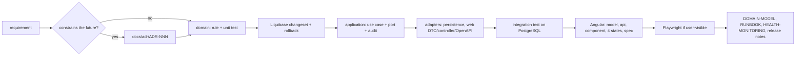

# How to modify AssetCare

The playbook for the changes people actually make. Each one lists the files in the order to touch them and the test
that proves it. AI assistants have the same playbook as skills in `.claude/skills/` (`/add-feature`, `/add-migration`,
`/write-adr`, `/operate`, `/release`, `/architecture-review`).

## Add a field to an existing entity
1. `domain/<Entity>.java`: the field, its invariant in the constructor or a method; `domain/<Entity>Test`.
2. `db/changelog/changes/NNN-*.yaml`: `addColumn` nullable (expand), reason, rollback; include in the master.
3. `adapter/in/web/dto`: add to the request and response records with validation; controller mapping.
4. `frontend/src/app/core/api/models.ts`, the form (`asset-form.ts`), the detail view; spec.
5. Prove: `make integration-test` (SchemaIT validates the mapping), `make test`.

## Add a use case (an action on an existing entity)
1. Domain method with the rule and the state transition; exception type from `domain/exception`.
2. `application/<Service>`: load → `AuthorizationPolicy` → domain method → save → `AuditRecorder`; unit test with Fakes.
3. Controller endpoint: `POST /api/v1/assets/{id}/<verb>` with `If-Match`; Problem Details for the failure cases;
   `@Operation` docs. `<Feature>IT` covering 2xx, 403, 409, 422.
4. Frontend: api method, button with `canWrite()` guard, dialog if it needs input, conflict handling, spec.

## Add a new entity
Follow "Add a field" plus: repository port in `application/port`, Spring Data interface and adapter in
`adapter/out/persistence`, a fake in `support/Fakes`, ownership rules in `AuthorizationPolicy`, a section in
`docs/architecture/DOMAIN-MODEL.md`, and an ADR if it changes ownership or lifecycle semantics.

## Add a role or permission
1. Keycloak: the realm role in `deploy/docker/keycloak/assetcare-realm.json` and the chart's copy; a demo user.
2. `infrastructure/security/SecurityConfiguration`: nothing, roles map generically to `ROLE_*`.
3. `application/AuthorizationPolicy`: the decision. `AuthorizationPolicyTest`.
4. Frontend `auth.service.ts` signal (`isX()`), guards, hidden controls. Playwright test for the role.

## Change configuration
1. `application.yml`: the property under `assetcare.*` with an `${ASSETCARE_X:default}` placeholder and a comment.
2. `configuration/AssetCareProperties`: the typed field.
3. `.env.example` (if local dev needs it), `deploy/helm/assetcare/values.yaml` + the ConfigMap in `templates/api.yaml`.
4. `docs/operations/DEPLOYMENT.md` values table and the release notes.

## Add a metric, an alert, a dashboard panel
1. Metric: `MeterRegistry` counter or timer in the application service (business) or a Micrometer binder
   (infrastructure); name `assetcare_<noun>_<unit>`.
2. Panel: edit the dashboard in Grafana, export JSON, save to `observability/grafana/dashboards/`, commit.
3. Alert: `observability/prometheus/rules.yml` with `for`, `severity`, `summary`, `runbook`; the runbook section it
   points at; the row in `HEALTH-MONITORING.md` §3.

## Add a scheduled job
`@Scheduled` on a `@Component` in `infrastructure/jobs` with `@SchedulerLock`-style single-instance protection when
more than one replica runs (ShedLock is the documented option; not added until `replicaCount > 1`). Emit a metric for
last success; add an alert on its staleness (pattern: `AssetCareBackupStale`).

## Replace a dependency (database, IdP, object storage)
`docs/operations/DEPLOYMENT.md` §7 and `docs/architecture/ORACLE-MIGRATION.md`. Everything is behind a port or a
value; the checklist there says which.

## Upgrade a framework version
1. Dependabot opens the PR; read the release notes for breaking changes (Spring Boot: the migration guide).
2. CI runs the full pipeline; ArchUnit and the ITs catch most package moves.
3. Update `VERSION-MATRIX.md` with the source you verified the version against, and the version in the article.
