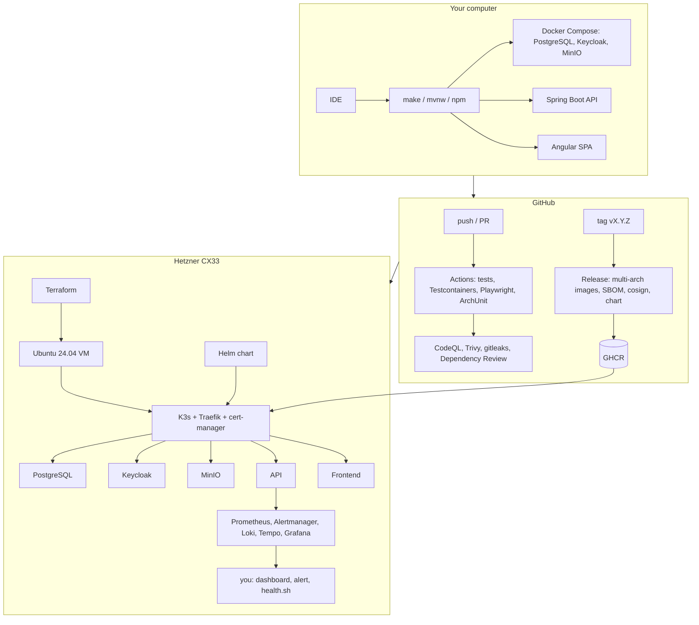

# Every tool and library, and what it does for you

A complete inventory of what AssetCare is built from, grouped by the job it does. For each one: what it is, what it
does in this project, and what it makes easy, meaning what you would have to do by hand without it. Versions are in
`VERSION-MATRIX.md`; this page is about purpose.

Reading tip: the "Makes easy" column is the reason the tool is here. If you ever want to replace one, that column is
the list of things the replacement must still do.

## 1. Languages and runtimes

| Tool | What it is | What it does here | Makes easy |
|---|---|---|---|
| **Java 25** | The language and virtual machine the backend runs on | Runs the API | Long-term support until 2031; virtual threads so thousands of waiting requests cost almost nothing; records and pattern matching keep the domain code short. Without it: a different backend language and ecosystem. |
| **Maven (via the wrapper `mvnw`)** | Build tool for Java: downloads libraries, compiles, runs tests, packages the jar | `./mvnw verify` does everything for the backend | Nobody installs Maven; the wrapper fetches the exact version. One command builds identically on your laptop and in CI. Without it: managing 150 library files and compile commands by hand. |
| **Node.js 24 and npm** | JavaScript runtime and package manager for the frontend tools | Runs the Angular build, tests and dev server | `npm ci` installs the exact library versions from the lock file every time. Without it: no modern frontend toolchain. |
| **TypeScript** | JavaScript with types | Every frontend file | The compiler catches wrong field names and null mistakes before the browser does. Without it: those mistakes appear as blank screens for users. |

## 2. Backend framework and libraries

| Library | What it is | What it does here | Makes easy |
|---|---|---|---|
| **Spring Boot 4.1** | The application framework: wiring, configuration, embedded web server, production features | The skeleton of the API; `application.yml` is its configuration | One `java -jar` starts a complete server. Configuration comes from files or environment variables without code. Without it: writing the plumbing (HTTP server, dependency injection, config loading) yourself. |
| **Spring Web MVC** (`spring-boot-starter-webmvc`) | HTTP layer: turns URLs into method calls and objects into JSON | The controllers under `adapter/in/web`; Problem Details error bodies | `@GetMapping("/assets/{id}")` is the whole routing. Validation errors, wrong content types and unknown paths become correct HTTP answers automatically. |
| **Spring Data JPA + Hibernate** | Maps Java objects to database tables and writes SQL for you | Repositories in `adapter/out/persistence`; entities in `domain` | `findByOwner(...)` is a query. Optimistic locking (`@Version`) and paging are one annotation each. Without it: hand-written SQL and result mapping for every table. |
| **Liquibase** | Database change management: a numbered list of changes applied in order | `db/changelog/`; runs at startup, records what it applied | The schema is versioned like code, applied identically on every environment, and every change has a rollback. Without it: someone runs SQL by hand and nobody knows which server has which columns. |
| **PostgreSQL JDBC driver** | Lets Java talk to PostgreSQL | The one database connection | Standard, boring, fast. Swap to Oracle's driver and `ORACLE-MIGRATION.md` to change databases. |
| **HikariCP** (inside Spring Boot) | Connection pool: keeps a few database connections open and lends them out | `spring.datasource.hikari` settings | Opening a connection per request would take longer than the query. Also exposes metrics used by two alerts. |
| **Spring Security + OAuth2 Resource Server** | Checks the login token on every request | `SecurityConfiguration`; role mapping | The API never sees passwords. It verifies Keycloak's signed token, reads the roles, and rejects everything else with 401/403. Without it: writing token verification and session handling yourself, which is where security bugs live. |
| **Jakarta Bean Validation** (`spring-boot-starter-validation`) | Annotations like `@NotBlank`, `@Size(max=200)` | Every request DTO | Bad input is rejected with a field-by-field error before it reaches business code. Without it: `if (name == null || name.isBlank())` in every method. |
| **Spring Boot Actuator** | Ready-made operational endpoints | `/actuator/health`, `/info`, `/prometheus`, `/metrics` | Kubernetes knows when to restart or stop routing (liveness/readiness); Prometheus gets metrics; you see which version runs. Without it: writing all of these endpoints. |
| **Micrometer + Prometheus registry** | Measures everything (requests, timings, JVM, pool) and exposes it in Prometheus format | Every metric on the dashboard; `assetcare_dependency_up` gauge | Request rate, error rate and latency per endpoint exist without a line of code. Custom counters are one line. |
| **Spring Boot OpenTelemetry starter** | Traces: a timeline of what one request did across the API and the database | Sends traces to the collector; puts `traceId` into every log line | "Where did the time go" is a click, not a guess. Logs, traces and metrics share the id. |
| **Spring Cache + Caffeine** | In-memory cache with size and time limits | Categories are cached (`@Cacheable("categories")`) | Reference data is served from memory. Replacing Caffeine with Redis when there are several API instances is configuration, not code (ADR-004). |
| **springdoc-openapi** | Generates the OpenAPI description and the Swagger UI from the controllers | `/v3/api-docs`, `/swagger-ui.html` | Documentation that cannot drift from the code, and a page where you can try every endpoint. Without it: a hand-written API document that is wrong within a month. |
| **AWS SDK for Java (S3)** | Client for any S3-compatible object storage | `S3AttachmentStorage`: MinIO locally, OCI Object Storage or S3 in the cloud | One adapter, three storage providers. Streams files without loading them into memory. |
| **JSpecify** | Annotations that say which values may be null | `@NullMarked` packages | The compiler and IDE point at possible null errors instead of users finding them. |
| **Spring Boot Docker Compose support** | Can start compose services with the app | Disabled by default (`make deps` is explicit) | Available for IDE-only workflows. |
| **Spring Boot Configuration Processor** | Generates metadata for `AssetCareProperties` | IDE autocomplete in `application.yml` | Typos in settings are underlined in the editor. |
| **git-commit-id plugin** | Writes the Git commit into the build | `/actuator/info` shows the commit | You always know exactly which code is running in production. |
| **CycloneDX Maven plugin** | Produces a software bill of materials (SBOM) | `target/bom.json` on every build; attached to releases | When the next big library vulnerability appears, one search tells you whether you are affected. |

## 3. Frontend framework and libraries

| Library | What it is | What it does here | Makes easy |
|---|---|---|---|
| **Angular 22** | The frontend framework: components, routing, forms, HTTP | The whole `frontend/src/app` | Standalone components, signals for state, typed forms and a router with guards are built in and work together. Without it: gluing five libraries and inventing conventions. |
| **Angular Material + CDK** | Ready-made accessible components: tables, dialogs, forms, snackbars, menus | Every screen | Keyboard navigation, screen-reader labels, focus handling and a consistent look come free. Without it: weeks of CSS and accessibility work. |
| **angular-oauth2-oidc** | Handles the login dance with Keycloak (OpenID Connect with PKCE) | `auth.service.ts` | Redirect to Keycloak, receive the token, refresh it silently, log out. Without it: implementing OAuth by hand, which is the classic way to get it wrong. |
| **RxJS** | Streams of events, used by Angular's HTTP client and router | Interceptors, HTTP calls | Cancelling stale requests and composing async steps stays readable. |
| **Vitest + jsdom** | Fast unit test runner for the frontend, with a fake browser | `*.spec.ts` files, `npx ng test` | Component and service tests run in seconds without a real browser. |
| **Playwright** | Drives a real browser through the app | `e2e/assetcare.spec.ts` | The only test that proves login, API and screens work together, including two people editing the same asset. |
| **ESLint + angular-eslint + Prettier** | Code style and mistake checker, and a formatter | `npm run lint`, `npm run format` | No arguments about formatting; common Angular mistakes flagged before review. |

## 4. Data and identity services (run as containers)

| Service | What it is | What it does here | Makes easy |
|---|---|---|---|
| **PostgreSQL 18** | The database | Stores everything except attachment bytes | Reliable, free, runs everywhere from a laptop to a managed cloud service. Partial indexes, JSONB for the audit diff, real transactions. |
| **Keycloak 26** | An identity server: users, passwords, roles, login pages, tokens | The `assetcare` realm with roles USER/ADMIN/AUDITOR | Login pages, password policies, forgotten-password flows, two-factor, and connecting to a company directory are configuration, not code. The API and SPA never handle passwords. Without it: building all of that, and being responsible for it. |
| **MinIO** | S3-compatible file storage you can run yourself | Attachment bytes, locally and on K3s | The same API as Amazon S3 and Oracle Object Storage, so the code is written once. |
| **MinIO client (`mc`)** | Command-line tool for MinIO | Creates the bucket at start (compose and the Helm hook) | No manual "create bucket" step. |

## 5. Containers and deployment

| Tool | What it is | What it does here | Makes easy |
|---|---|---|---|
| **Docker + Compose** | Runs programs in sealed boxes with their own files and network; Compose starts several at once | `docker compose up -d --wait` starts PostgreSQL, Keycloak and MinIO with health checks | Nobody installs a database on their laptop. Every developer and CI has the identical versions. `--wait` returns only when everything is healthy. |
| **Eclipse Temurin images** | Official OpenJDK container images | Backend image: JDK to build, JRE to run | Small, patched, multi-architecture. |
| **nginx-unprivileged** | The web server that serves the built frontend, running as a normal user | Frontend image; SPA routing, cache and security headers, CSP | Serving static files is what nginx is best at; the unprivileged variant is safer in Kubernetes. |
| **Spring Boot layered jar** | Splits the jar into layers that change at different speeds | `extract --layers` in the Dockerfile | A code change rebuilds a few megabytes instead of the whole image; pulls and deploys are faster. |
| **Kubernetes** | Keeps containers running, restarts them, routes traffic, stores config and secrets, scales | The production platform | Restarts on crash, zero-downtime updates, health-based routing, one description of the whole system. Without it: shell scripts and someone SSH-ing in at night. |
| **K3s** | A small, single-binary Kubernetes | The reference cluster on one VM | Full Kubernetes in a five-minute install with 500 MB of memory, bundled ingress (Traefik) and storage. |
| **Helm** | Package manager for Kubernetes: templates plus values | `deploy/helm/assetcare` | One command installs or upgrades everything; every environment difference is a value; `helm rollback` returns to the previous release. Without it: dozens of YAML files edited by hand per environment. |
| **Traefik** (bundled with K3s) | Ingress controller: the front door that routes URLs to services | Routes `/` to the SPA, `/api` to the API, `/auth` to Keycloak; edge rate limiting | One public IP, one certificate, several services. |
| **cert-manager + Let's Encrypt** | Requests and renews HTTPS certificates automatically | `ClusterIssuer`s in `deploy/k3s` | The padlock appears on its own and renews a month early, forever, for free. Without it: renewing certificates by hand every 90 days. |
| **Terraform + hcloud provider** | Describes cloud resources in files and creates them | `infra/hetzner`: the CX33 server, SSH key, cloud firewall, backups (`infra/oci` keeps the earlier OCI version) | Reproducible: the same server again in ten minutes, reviewed like code. Without it: clicking through the console and forgetting a firewall rule. |
| **Hetzner Cloud CX33** | A rented x86 server with 4 cores, 8 GB and 80 GB, billed by the hour with a small monthly cap | Hosts the production trial (ADR-012) | Real production experience for a few euros a month, available on demand, data in the EU. |
| **kubectl** | Command-line client for Kubernetes | Every `kubectl` in the guides | Look at pods, logs, secrets; restart; port-forward to the dashboards. |

## 6. Quality, testing and security checks

| Tool | What it is | What it does here | Makes easy |
|---|---|---|---|
| **JUnit 5 + AssertJ** | Test framework and readable assertions for Java | All backend tests | `assertThat(health.getStatus()).isEqualTo(UP)` reads like a sentence and fails with a clear message. |
| **Testcontainers** | Starts real PostgreSQL in Docker for tests | `PostgresIT`, all `*IT` classes | Integration tests run against the real database engine, not a fake, and clean up after themselves. Without it: tests that pass on H2 and fail in production. |
| **ArchUnit** | Tests that check code structure | `ArchitectureTest`: the domain may not import Spring, adapters may not be called from the domain | The architecture is enforced by the build, not by reviews that miss things. |
| **Spring Security Test** | Fakes a logged-in user with chosen roles in tests | `TestUsers.jwt(...)` | Testing "an AUDITOR cannot archive" without running Keycloak. |
| **Surefire and Failsafe** | Maven plugins that run unit tests and integration tests separately | `*Test` in `test`, `*IT` in `verify` | Fast feedback locally (no Docker) and full checks in CI. |
| **k6** | Load-testing tool with pass/fail thresholds | `performance/k6/*.js` | "Is it fast enough" becomes a number and a CI verdict, not an opinion. |
| **CodeQL** | GitHub's code scanner for security bugs (SQL injection, path traversal, ...) | `security.yml`, Java and TypeScript | Finds vulnerability patterns humans skim past; results in the Security tab. |
| **Trivy** | Scanner for vulnerable libraries, misconfigured infrastructure files and secrets | Repository scan and both container images | Blocks a release whose base image has a known critical hole. |
| **Dependency Review** | GitHub check on pull requests | Fails a PR that adds a vulnerable or badly licensed dependency | Problems are caught when they are introduced, not months later. |
| **gitleaks** | Scans the Git history for secrets | `security.yml` | A committed password is found the same day, including in old commits. |
| **Dependabot** | Opens pull requests for outdated dependencies | `.github/dependabot.yml`, weekly, grouped | Staying current is reviewing a PR, not remembering to check. |
| **CycloneDX / npm sbom** | SBOM for backend and frontend | CI artifacts, release assets | See section 2. |
| **cosign + provenance attestation** | Signs container images and records how they were built | `release.yml` | Anyone can verify that an image really came from this repository's pipeline and was not tampered with. |

## 7. Observability (seeing what the system does)

| Tool | What it is | What it does here | Makes easy |
|---|---|---|---|
| **Prometheus** | Collects numbers (metrics) every 15 seconds and evaluates alert rules | Scrapes `/actuator/prometheus`; `rules.yml` | "How many requests, how many errors, how fast, since when" for any time range, plus alerts when a number crosses a line. Without it: guessing from logs. |
| **Alertmanager** | Receives alerts from Prometheus and decides who gets told, when, and which alerts are silenced by bigger ones | `observability/alertmanager` | One outage is one notification, not twelve; warnings wait for working hours; a webhook or email is the whole setup. |
| **Blackbox exporter** | Probes URLs from the outside, like a user would | Probes the public host and checks anonymous calls are refused | Detects broken DNS, expired TLS or a dead ingress that internal metrics cannot see. |
| **Grafana** | Dashboards and exploration over metrics, logs and traces | "AssetCare overview" dashboard, provisioned from Git | One screen answers "is it healthy"; the dashboard is a file in Git, so it survives reinstalling. |
| **Loki** | Stores logs and lets you search them by labels and text | JSON logs from the API | Find every line of one request by its id in seconds, across restarts and pods. |
| **Tempo** | Stores traces | Receives OTLP traces from the API | Click from a log line to the full timeline of that request. |
| **OpenTelemetry Collector** | One receiver that forwards logs and traces to the right store | `observability/otel/collector.yaml` | The application sends everything to one address; where it ends up is configuration. |
| **kube-prometheus-stack** (Helm chart) | The same stack packaged for Kubernetes, plus node and pod metrics | `deploy/helm/observability` | Cluster and application monitoring installed with a few `helm` commands. |
| **Structured (ECS/JSON) logging** (Spring Boot) | Every log line is a JSON object with fields | `ASSETCARE_LOG_FORMAT=ecs` in containers | Machines can filter by `requestId`, `user`, `level`; humans get plain text locally. |

## 8. Developer and operator tools

| Tool | What it is | What it does here | Makes easy |
|---|---|---|---|
| **Git + GitHub** | Version control and hosting | The repository, pull requests, Actions, Security tab, Packages, Releases | Every change is reviewed, tested and traceable; images and charts are published next to the code. |
| **GitHub Actions** | Runs the pipelines on GitHub's computers | `ci.yml`, `security.yml`, `release.yml` | Every push runs every test, scan and image build with no server of your own. |
| **GitHub CLI (`gh`)** | GitHub from the terminal | Watching runs, checking scopes | `gh run watch` instead of clicking through pages. |
| **make** | Runs named shortcuts from the `Makefile` | `make backend`, `make test`, `make status`, ... | Nobody memorises long commands; `make help` lists them. |
| **`make doctor`** | Project script | Checks tools, versions, Docker and free ports | Tells a newcomer exactly which setup step to fix. |
| **`scripts/health.sh`** | Project script | One-screen OK/WARN/FAIL of a running system | The first command in every incident; names the runbook section. |
| **`scripts/backup.sh` / `restore.sh`** | Project scripts | Compressed, checksummed dumps; restore into a side database and swap | Backup and restore are two commands and are exercised in CI. |
| **`scripts/smoke-test.sh`** | Project script | Five HTTP checks against a deployment | "Did the deploy work" in three seconds. |
| **curl + jq** | HTTP from the terminal, and JSON formatting | All the verification steps | Talk to the API without a browser and read the answers. |
| **SDKMAN, nvm** | Version managers for Java and Node | Setup steps L3, L4 | Several versions side by side; upgrading is one command. |
| **EditorConfig** | Shared editor settings | `.editorconfig` | Same indentation in every editor. |
| **CLAUDE.md, AGENTS.md, `.claude/skills`** | Guidance for AI coding assistants | Rules, playbooks for feature, migration, ADR, operate, release, review | An assistant follows the same architecture as a human and does not invent a second way. |

## 9. How they fit together

## 10. What is deliberately not here

| Not used | Why | When it would come in |
|---|---|---|
| Kafka or another message broker | no requirement for asynchronous consumers; the audit table is the event log | a second system must react to changes → outbox table + broker (ADR-001) |
| Redis | one API instance; Caffeine is enough | several instances must share a cache or sessions (ADR-004) |
| Microservices | one team, one domain; a modular monolith is faster to build, test and run | independent teams with independent release cadences |
| A managed database | free tier first; PostgreSQL on a volume is enough for the reference | real users and an SLA → managed PostgreSQL (`PRODUCTION-GAPS.md`) |
| Argo CD / GitOps | `helm upgrade` from a laptop is fine for one cluster | several clusters or environments → Argo CD watching the chart |
| A service mesh | one node, six services; Traefik and Kubernetes networking suffice | mutual TLS between many services across nodes |
| Lombok | records and modern Java remove the need | never, by decision (`CODING-STANDARDS.md`) |
