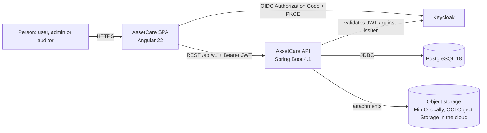
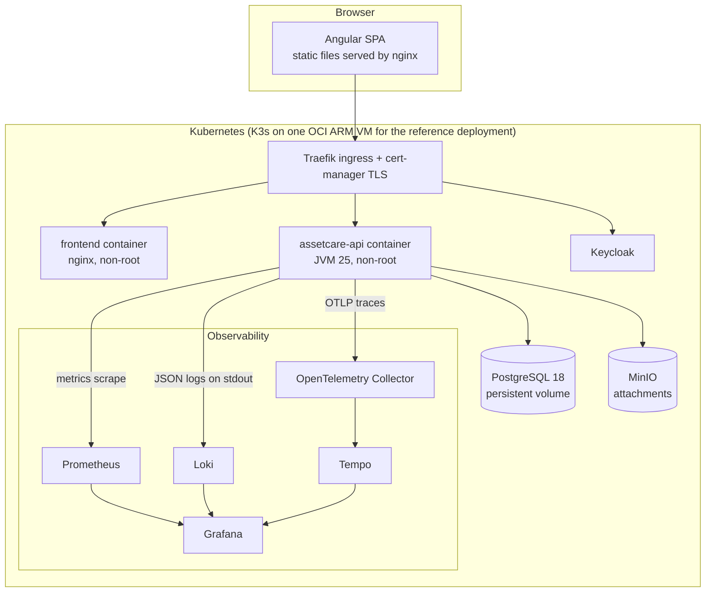
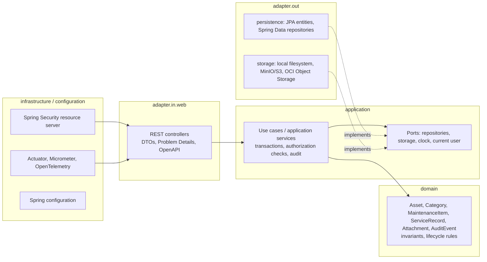
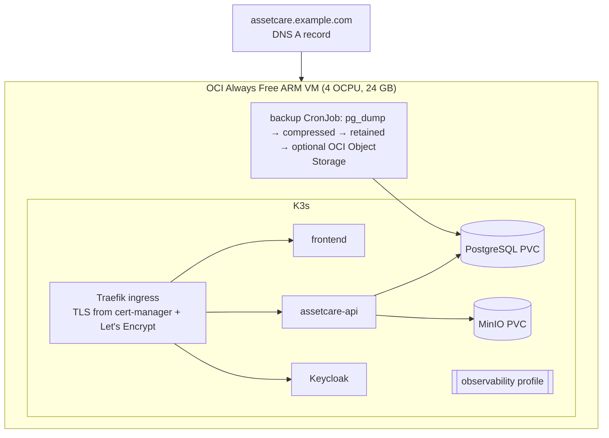
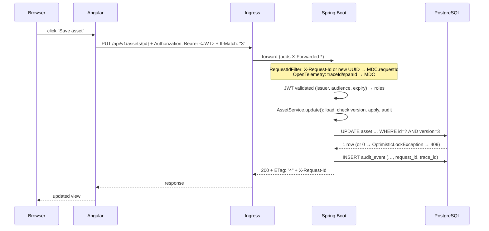

# AssetCare architecture

AssetCare is a personal and enterprise asset-maintenance manager: the things you own or operate, what they cost,
when their warranties end, what maintenance is due, what was done to them, and a trustworthy history of who changed what.
It is built as **one Angular SPA plus one independently deployable Spring Boot service** on PostgreSQL, with Keycloak
for identity and an OpenTelemetry-based observability stack. Every diagram here is text so it lives in Git.

## 1. System context



The browser talks to two things: the SPA's static files and the API. The API is the only component that talks to the
database. Keycloak owns identity; the application never stores a password.

## 2. Container diagram



Two Helm profiles exist because the free VM is small: **core** (frontend, API, PostgreSQL, Keycloak, MinIO) and
**observability** (adds the collector, Prometheus, Loki, Tempo, Grafana). See `docs/operations/OCI-FREE-TIER.md`.

## 3. Backend: clean architecture and dependency direction



Arrows point inward. `domain` depends on nothing from Spring, JPA, HTTP, Keycloak or the cloud. `application` depends
on `domain` and defines the ports it needs. Adapters depend on `application` and `domain` and implement the ports.
This is enforced by ArchUnit tests in `backend/src/test/java/.../architecture`, not by convention alone.

Package layout:

```text
me.janaka.assetcare
├── domain              entities as plain Java (records and classes), value objects, domain exceptions
├── application         use-case services, ports (interfaces), commands/queries, authorization policy
├── adapter
│   ├── in.web          controllers, request/response DTOs, mappers, error handling
│   └── out
│       ├── persistence JPA entities, Spring Data repositories, port implementations
│       └── storage     attachment storage implementations
├── infrastructure      security, observability, auditing, idempotency, clock
└── configuration       @Configuration classes and properties
```

Where future services could be extracted, and why not yet: a **notification service** (due-date reminders by e-mail
or push) and a **document service** (attachment processing, previews) would each be a natural boundary because they
have their own scaling profile and external dependencies. A **reporting service** would follow if read load or
analytical queries diverge from transactional ones. None of them exists today because no requirement needs them; the
`application` layer already isolates the seams, so extraction is a move of code behind a port, not a rewrite.

## 4. Deployment architecture (reference)



This is one VM. It is not highly available and is not described as such anywhere in this repository.
`docs/PRODUCTION-GAPS.md` lists what an enterprise replaces: managed multi-node Kubernetes, managed HA PostgreSQL or
Oracle, a vault for secrets, corporate PKI, multi-AZ.

## 5. Request trace



Every log line the API writes during that request carries `traceId`, `spanId` and `requestId`. The trace is in Tempo,
the metrics in Prometheus, the log lines in Loki, and Grafana links the three by the trace id.

## 6. Scaling path

From one Angular container, one API replica and one PostgreSQL:

1. **First bottleneck: the API's database connection pool and PostgreSQL CPU.** Add API replicas (stateless, so this is
   a number in Helm values) and size Hikari so `replicas × pool` stays below PostgreSQL `max_connections` with headroom.
2. **Read load:** indexes already exist for the list, search and due-date queries; add Caffeine caching for categories and
   reference data. Redis only when several replicas need a shared cache with invalidation.
3. **Database:** move to a managed HA PostgreSQL (or Oracle, see `docs/architecture/ORACLE-MIGRATION.md`); add read replicas
   for reporting when analytical queries appear.
4. **Static assets:** put the SPA behind a CDN.
5. **Asynchronous work:** notifications and document processing through a transactional outbox and a broker, extracted
   into their own services as described above. Kafka appears at that point and not before.

See also `DOMAIN-MODEL.md` (concepts) and `DATABASE-MODEL.md` (the physical schema with diagrams).
