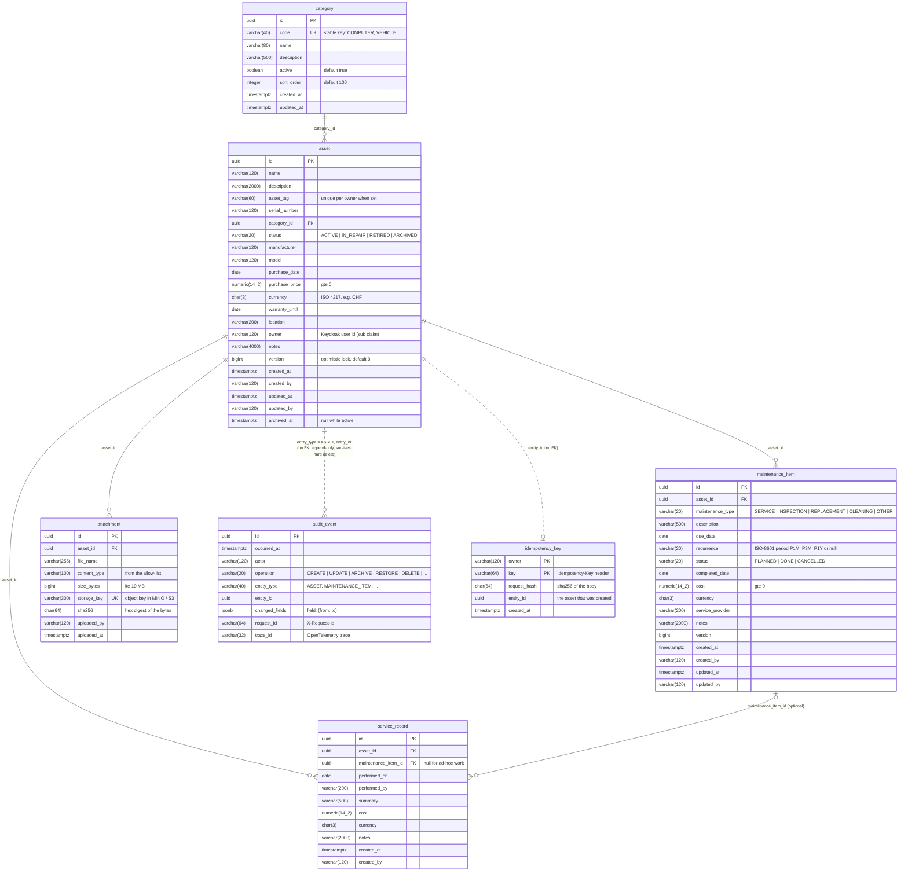

# Database model

The physical schema, as PostgreSQL 18 sees it after every Liquibase changeset in
`backend/src/main/resources/db/changelog/changes/` has run. `DOMAIN-MODEL.md` explains the business concepts; this
page is the tables, columns, keys, constraints and indexes, with the reason for each. The diagrams render on GitHub
and in any Mermaid viewer.

## 1. The whole schema



Seven tables. Everything hangs off **asset**. Two tables point at assets without a foreign key on purpose:
`audit_event`, because the history must outlive a hard delete by an ADMIN, and `idempotency_key`, because it is a
cache of responses, not part of the model.

## 2. Conventions every table follows

| Convention | How | Why |
|---|---|---|
| Primary keys are UUIDs generated by the application | `uuid id` on every entity table | Ids can be created before the insert, do not leak counts, and merge across environments (ADR-005). |
| Nothing is deleted, it is archived | `asset.status = 'ARCHIVED'` and `archived_at`; `service_record` and `audit_event` are append-only | History and audit stay intact; an ADMIN can restore (ADR-010). |
| Every mutable table has audit columns | `created_at, created_by, updated_at, updated_by` | Who and when, without joining the audit table. Append-only tables carry only `created_*` / `uploaded_*`. |
| Every mutable table has `version` | `bigint`, default 0, incremented by Hibernate | Optimistic locking: two people editing the same row, the second save fails with 409 instead of overwriting (ADR-009). Exposed to clients as the `ETag`. |
| Time is `timestamp with time zone`, stored in UTC | `hibernate.jdbc.time_zone: UTC` | No daylight-saving surprises; the browser formats for the user. Calendar dates (`purchase_date`, `due_date`) are `date`. |
| Money is `numeric(14,2)` plus a `char(3)` currency | `purchase_price/currency`, `cost/currency` | Exact decimals, never floating point; one amount is one currency; no conversion is stored. |
| Closed sets are `varchar` with a CHECK constraint, not a database enum | `ck_asset_status`, `ck_maintenance_type`, ... | Adding a value is a one-line changeset; the constraint still stops bad data from ad-hoc SQL. Same on Oracle. |
| Text lengths match the API validation | `varchar(120)` for names, `varchar(2000)`/`varchar(4000)` for notes | A too-long value is rejected with a 422 and a field name, not a database error. |
| Users are referenced by their identity-provider id | `owner`, `created_by`, `actor` are `varchar(120)` holding the Keycloak `sub` | No users table to keep in sync; Keycloak owns identity. |
| Every constraint and index has a name | `pk_`, `fk_`, `uq_`, `ck_`, `ix_` prefixes | Violations are readable in logs and Problem Details; migrations can reference them. |

## 3. Table by table

### category (reference data)

Managed by ADMINs, cached in the API for five minutes (Caffeine). Loaded from `data/categories.csv` by changeset 100.

| Column | Type | Constraint | Note |
|---|---|---|---|
| id | uuid | PK `pk_category` | |
| code | varchar(40) | NOT NULL, UNIQUE `uq_category_code` | the stable key the UI and imports use; `name` may change, `code` never |
| name | varchar(80) | NOT NULL | shown to users |
| description | varchar(500) | | |
| active | boolean | NOT NULL, default true | inactive categories are hidden from new assets but kept for existing ones |
| sort_order | integer | NOT NULL, default 100 | display order in dropdowns |
| created_at, updated_at | timestamptz | NOT NULL | |

### asset (the aggregate root)

| Column | Type | Constraint | Note |
|---|---|---|---|
| id | uuid | PK `pk_asset` | |
| name | varchar(120) | NOT NULL | |
| description | varchar(2000) | | |
| asset_tag | varchar(60) | unique per owner (`uq_asset_owner_tag`, partial: only when not null) | a label the owner chooses, e.g. `LAPTOP-1`; two owners may use the same tag |
| serial_number | varchar(120) | | manufacturer's serial |
| category_id | uuid | NOT NULL, FK `fk_asset_category` → category | |
| status | varchar(20) | NOT NULL, `ck_asset_status` in (ACTIVE, IN_REPAIR, RETIRED, ARCHIVED) | see the state diagram below |
| manufacturer, model | varchar(120) | | |
| purchase_date | date | | |
| purchase_price | numeric(14,2) | `ck_asset_price` ≥ 0 | |
| currency | char(3) | `ck_asset_currency` matches `^[A-Z]{3}$` | required by the application when a price is set |
| warranty_until | date | | the dashboard shows warranties ending within 30 days |
| location | varchar(200) | | free text |
| owner | varchar(120) | NOT NULL | Keycloak user id; every list query filters on it |
| notes | varchar(4000) | | |
| version | bigint | NOT NULL, default 0 | optimistic lock |
| created_at, created_by, updated_at, updated_by | | NOT NULL | |
| archived_at | timestamptz | | set together with status ARCHIVED; cleared on restore |

Indexes:

| Index | Columns | Serves |
|---|---|---|
| `ix_asset_owner_status_updated` | (owner, status, updated_at DESC) | `GET /api/v1/assets`: my assets, not archived, newest first (the default list) |
| `uq_asset_owner_tag` | (owner, asset_tag) WHERE asset_tag IS NOT NULL | uniqueness per owner, and lookup by tag |

Search (`?q=`) uses `lower(name) LIKE` and `lower(asset_tag) LIKE` on the owner's rows; with a few thousand assets per
owner the owner index makes that cheap. A trigram index is the documented next step in `SCALING.md` if search grows.

```mermaid
stateDiagram-v2
    [*] --> ACTIVE : create
    ACTIVE --> IN_REPAIR : send for repair
    IN_REPAIR --> ACTIVE : repaired
    ACTIVE --> RETIRED : retire
    IN_REPAIR --> RETIRED : retire
    ACTIVE --> ARCHIVED : archive (sets archived_at)
    IN_REPAIR --> ARCHIVED : archive
    RETIRED --> ARCHIVED : archive
    ARCHIVED --> ACTIVE : restore (ADMIN only, clears archived_at)
    ARCHIVED --> [*] : hard delete (ADMIN only; audit_event rows remain)
```



### maintenance_item (what is due)

| Column | Type | Constraint | Note |
|---|---|---|---|
| id | uuid | PK | |
| asset_id | uuid | NOT NULL, FK `fk_maintenance_item_asset` | |
| maintenance_type | varchar(20) | `ck_maintenance_type` in (SERVICE, INSPECTION, REPLACEMENT, CLEANING, OTHER) | |
| description | varchar(500) | NOT NULL | |
| due_date | date | NOT NULL | |
| recurrence | varchar(20) | | ISO-8601 period: `P1M`, `P3M`, `P1Y`; null means one-off |
| status | varchar(20) | `ck_maintenance_status` in (PLANNED, DONE, CANCELLED) | |
| completed_date | date | | set when DONE |
| cost, currency | numeric(14,2), char(3) | `ck_maintenance_cost` ≥ 0 | what completing it cost |
| service_provider | varchar(200) | | |
| notes | varchar(2000) | | |
| version, audit columns | | NOT NULL | |

Indexes: `ix_maintenance_item_asset` (asset_id) for the asset detail page; `ix_maintenance_item_due` (due_date)
WHERE status = 'PLANNED', a partial index for the dashboard's "due in the next 30 days" across an owner's assets.

Completing a recurring item does not change its `due_date`: the item becomes DONE and a **new** PLANNED item is inserted
with `due_date + recurrence`. History stays exact; the `complete()` method in the domain returns the successor.

```mermaid
stateDiagram-v2
    [*] --> PLANNED : plan
    PLANNED --> DONE : complete (writes a service_record; recurring → new PLANNED successor)
    PLANNED --> CANCELLED : cancel
    PLANNED --> PLANNED : reschedule (due_date changes, version increments)
```



### service_record (what was done)

Append-only history. A record may complete a maintenance item (`maintenance_item_id` set) or stand alone for ad-hoc
work such as an unplanned repair.

| Column | Type | Constraint |
|---|---|---|
| id | uuid | PK |
| asset_id | uuid | NOT NULL, FK `fk_service_record_asset` |
| maintenance_item_id | uuid | FK `fk_service_record_item`, nullable |
| performed_on | date | NOT NULL |
| performed_by | varchar(200) | who did the work (free text: a garage, a colleague) |
| summary | varchar(500) | NOT NULL |
| cost, currency | numeric(14,2), char(3) | |
| notes | varchar(2000) | |
| created_at, created_by | | NOT NULL |

Index: `ix_service_record_asset_date` (asset_id, performed_on DESC): the history tab, newest first.

### attachment (file metadata)

The bytes live in object storage (MinIO, OCI Object Storage, S3); the row is the catalogue entry (ADR-007).

| Column | Type | Constraint | Note |
|---|---|---|---|
| id | uuid | PK | |
| asset_id | uuid | NOT NULL, FK `fk_attachment_asset` | |
| file_name | varchar(255) | NOT NULL | as uploaded; shown to users |
| content_type | varchar(100) | NOT NULL | must be in `assetcare.attachments.allowed-content-types` |
| size_bytes | bigint | NOT NULL | ≤ `assetcare.attachments.max-size-bytes` (10 MB) |
| storage_key | varchar(300) | NOT NULL, UNIQUE `uq_attachment_storage_key` | `assets/<asset id>/<attachment id>`; never user-supplied |
| sha256 | char(64) | NOT NULL | computed while streaming the upload; a download can be verified |
| uploaded_by, uploaded_at | | NOT NULL | |

Index: `ix_attachment_asset` (asset_id).

### audit_event (business history)

Written in the same transaction as the change by `AuditRecorder`. If the change rolls back, so does the event. This is
the answer to "who changed this and when", not an operational log (those go to Loki).

| Column | Type | Note |
|---|---|---|
| id | uuid | PK |
| occurred_at | timestamptz | NOT NULL |
| actor | varchar(120) | Keycloak user id |
| operation | varchar(20) | CREATE, UPDATE, ARCHIVE, RESTORE, DELETE, PLAN, COMPLETE, CANCEL, UPLOAD, ... |
| entity_type | varchar(40) | ASSET, MAINTENANCE_ITEM, SERVICE_RECORD, ATTACHMENT, CATEGORY |
| entity_id | uuid | no FK on purpose |
| changed_fields | jsonb | `{"status": {"from": "ACTIVE", "to": "IN_REPAIR"}, ...}`; only the fields that changed; never notes longer than a preview, never secrets |
| request_id | varchar(64) | the `X-Request-Id` of the HTTP request: joins the audit row to its log lines |
| trace_id | varchar(32) | the OpenTelemetry trace: joins it to the timeline in Tempo |

Index: `ix_audit_event_entity` (entity_type, entity_id, occurred_at DESC): the history tab of one asset. On Oracle
`jsonb` becomes `JSON`/`CLOB` through the `${json.type}` Liquibase property.

### idempotency_key (retry safety)

| Column | Type | Note |
|---|---|---|
| owner | varchar(120) | PK part 1: keys are per user, so two users may send the same key |
| key | varchar(64) | PK part 2: the `Idempotency-Key` header |
| request_hash | char(64) | sha256 of the request body; the same key with a different body is a 422, not a replay |
| entity_id | uuid | the asset created the first time; the replay returns it with 200 instead of creating a second one |
| created_at | timestamptz | rows older than 24 h are eligible for cleanup |

### Liquibase's own tables

`databasechangelog` (every changeset that ran, with checksum and date) and `databasechangeloglock` (one row; the
lock a starting instance takes while migrating). `SELECT id, dateexecuted FROM databasechangelog ORDER BY orderexecuted`
tells you exactly which schema version a database has.

## 4. The main queries and the index each one uses

| Screen or endpoint | Query shape | Index |
|---|---|---|
| Asset list, default | `WHERE owner = ? AND status <> 'ARCHIVED' ORDER BY updated_at DESC LIMIT 20` | `ix_asset_owner_status_updated` |
| Asset list, filter by status or category, sort by name | `WHERE owner = ? AND status = ? [AND category_id = ?] ORDER BY name` | same index for the owner+status part; sort in memory over the owner's rows |
| Asset search | `WHERE owner = ? AND (lower(name) LIKE ? OR lower(asset_tag) LIKE ?)` | owner index narrows; LIKE scans the owner's rows |
| Asset by id | `WHERE id = ?` then owner check in `AuthorizationPolicy` | `pk_asset` |
| Dashboard: due soon | `JOIN asset a ON ... WHERE a.owner = ? AND m.status = 'PLANNED' AND m.due_date <= ?` | `ix_maintenance_item_due` (partial) + `ix_asset_owner_status_updated` |
| Dashboard: warranties ending | `WHERE owner = ? AND warranty_until BETWEEN now AND now + 30d` | owner index; small result |
| Asset detail tabs | `WHERE asset_id = ? ORDER BY ...` on maintenance_item, service_record, attachment | the three `ix_*_asset*` indexes |
| History tab | `WHERE entity_type = 'ASSET' AND entity_id = ? ORDER BY occurred_at DESC` | `ix_audit_event_entity` |
| Auditor: everything | same queries without the owner filter | status and due indexes; acceptable at reference scale, see `SCALING.md` |
| Retry of a create | `WHERE owner = ? AND key = ?` | `pk_idempotency_key` |

`EXPLAIN (ANALYZE, BUFFERS)` in front of any of these shows the index in use; each index also has a `COMMENT ON INDEX`
in the database saying which query it serves (changeset `002-asset-index-comments`).

## 5. How big it gets

Rough row sizes on PostgreSQL 18, to reason about volumes and backups:

| Table | Bytes per row (typical) | Rows per 1 000 assets over 5 years | Notes |
|---|---|---|---|
| asset | ~600 | 1 000 | the only table users grow directly |
| maintenance_item | ~400 | 10 000 to 30 000 | recurring items create a successor each cycle |
| service_record | ~350 | 10 000 to 30 000 | one per completion plus ad-hoc work |
| attachment | ~250 (+ bytes in object storage) | 2 000 to 5 000 | 10 MB cap each; object storage is the real volume |
| audit_event | ~400 + JSON | 5 to 10 per business row | the largest table over time; archive by `occurred_at` when needed |
| idempotency_key | ~200 | transient | delete rows older than a day |

A 1 000-asset installation stays well under 100 MB of PostgreSQL data after five years; the nightly dump is a few
megabytes compressed. Attachments dominate storage and are counted in object storage, not here.

## 6. Looking at the live database

Local (compose):

```bash
docker compose exec postgres psql -U assetcare -d assetcare
```

Production: never expose PostgreSQL; open a tunnel instead.

```bash
kubectl -n assetcare port-forward svc/assetcare-postgres 5433:5432 &
psql "postgresql://assetcare@localhost:5433/assetcare"     # password from the assetcare-secrets Secret
```

Useful commands once inside `psql`:

```sql
\dt                                                   -- list tables
\d+ asset                                             -- columns, constraints, indexes of one table
SELECT id, dateexecuted FROM databasechangelog ORDER BY orderexecuted;   -- schema version
SELECT status, count(*) FROM asset GROUP BY status;   -- how many assets in each state
SELECT relname, n_live_tup FROM pg_stat_user_tables ORDER BY n_live_tup DESC;   -- row counts
SELECT indexrelname, idx_scan FROM pg_stat_user_indexes ORDER BY idx_scan;      -- unused indexes have idx_scan = 0
SELECT * FROM audit_event WHERE request_id = '<X-Request-Id from an error page>';  -- what one request changed
```

Read-only is the rule in production. Data changes go through the API so that validation, authorization, optimistic
locking and the audit trail apply; the only exception is a documented restore (`BACKUP-RESTORE.md`).

## 7. Changing the schema

`docs/HOW-TO-MODIFY.md` and the `/add-migration` skill: a new changeset with a reason and a rollback, expand/contract
so the previous version keeps running during a rolling update, a name for every constraint, and an index for every new
query. After the change, update the diagram in section 1 and the table in section 3; the diagram is the schema's
documentation of record.
