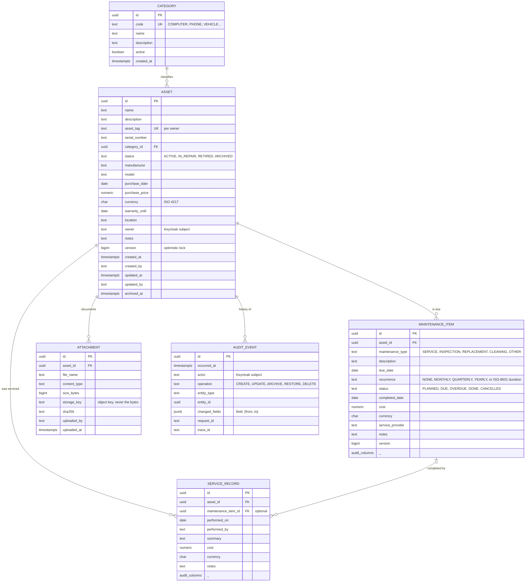
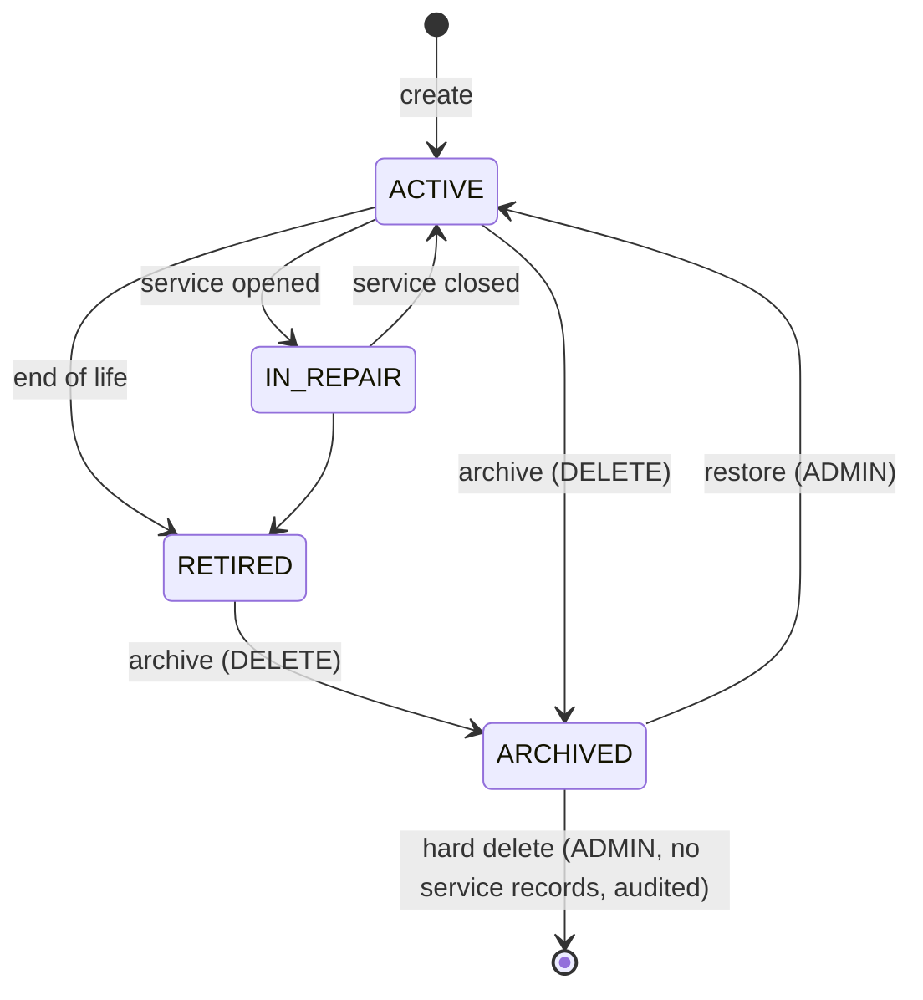

# AssetCare domain model

This page is the business view. The physical schema, column by column with constraints, indexes, state diagrams and
the query-to-index map, is `DATABASE-MODEL.md`.

The model serves a person tracking a laptop, a car and a boiler as well as an organisation tracking a fleet. It does
that by keeping the core small and generic and putting configuration (categories, maintenance types) in data.

## Decisions embedded in the model

- **UUID identifiers** everywhere. They can be generated by the application before the row exists, which makes
  idempotent creates and client-side correlation simple, and they do not leak record counts. `uuid` in PostgreSQL is a
  native 16-byte type with a proper index.
- **Archive, not delete.** `DELETE /assets/{id}` sets `status = ARCHIVED` and `archived_at`; the row and its history stay.
  A hard delete exists only for admins on archived assets that have no service records, and is itself audited. Business
  history must be retained; a deleted row cannot be explained to an auditor.
- **Optimistic locking** with a `version` column on every editable aggregate. The API exposes it as an `ETag` and expects
  `If-Match`; a stale update returns `409 Conflict` with a Problem Details body that says who changed it and when.
- **Ownership** is the Keycloak subject id. A `USER` sees and edits their own assets; an `ADMIN` sees all; an `AUDITOR`
  reads everything, including history, and can change nothing. Authorization is enforced in the application layer,
  per aggregate, and the UI only mirrors it.
- **Money** is `numeric(14,2)` plus an ISO 4217 currency code. No floating point.
- **Attachments store metadata only.** Bytes go to object storage behind a port. The relational database holds the key,
  the size and a SHA-256 for integrity.
- **Audit events are not logs.** Logs are operational and can be sampled or dropped; audit events are business records
  with a retention policy, written in the same transaction as the change they describe.
- **Categories and maintenance types are data.** Admins manage categories; maintenance types are a small enumeration
  with an `OTHER` escape hatch and a free-text description, which covers personal use without a configuration screen.

## Lifecycle

Maintenance items move `PLANNED → DUE → OVERDUE` by date, `→ DONE` when a service record completes them (a recurring
item then schedules its successor), or `→ CANCELLED`.
