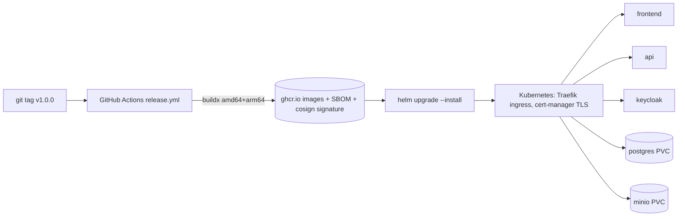

# Deployment

AssetCare ships as two OCI images and one Helm chart. The chart runs on any Kubernetes; the reference target is K3s on
one Oracle Cloud Always Free VM (`OCI-FREE-TIER.md`). This page is the generic path; the enterprise variations are at
the end.



## 1. Images

| Image | Base | User | Ports | Built by |
|---|---|---|---|---|
| `assetcare-api` | `eclipse-temurin:25-jre` (multi-stage from `eclipse-temurin:25-jdk`) | uid 10001 | 8080 | `backend/Dockerfile` |
| `assetcare-frontend` | `nginxinc/nginx-unprivileged:1.29-alpine` (built on `node:24.21.0-alpine3.24`) | uid 101 | 8080 | `frontend/Dockerfile` |

Both are built for `linux/amd64` and `linux/arm64` by `.github/workflows/release.yml` on every `v*` tag, scanned with
Trivy, given a CycloneDX SBOM and signed with cosign (keyless, GitHub OIDC). Tags are the version and the commit SHA;
`latest` is never published or referenced.

The API image uses Spring Boot's layered extraction so dependency layers are cached between builds, exits on
OutOfMemoryError so Kubernetes restarts it, sizes its heap from the cgroup limit, and shuts down gracefully on SIGTERM.
The frontend image renders `config.json` and the Content-Security-Policy from `API_URL`, `OIDC_ISSUER` and
`OIDC_CLIENT_ID` at start, so one image serves every environment.

Local build: `make docker`.

## 2. Cluster prerequisites

- Kubernetes 1.29+ with an ingress controller (Traefik on K3s; annotations in `values.yaml` are Traefik's) and a
  default StorageClass.
- cert-manager with a `ClusterIssuer` named `letsencrypt-prod` (`deploy/k3s/cluster-issuer.yaml`; change the email).
- A DNS A record for the host you set in `global.host`, pointing at the ingress IP.
- Registry access if the GHCR packages are private: `kubectl create secret docker-registry ghcr --docker-server=ghcr.io ...`
  and `global.imagePullSecrets=[{name: ghcr}]`.

## 3. Secrets

Never put production secrets in `values.yaml`. Create one Secret with these keys and reference it:

```bash
kubectl -n assetcare create secret generic assetcare-secrets \
  --from-literal=ASSETCARE_DB_PASSWORD='...' \
  --from-literal=ASSETCARE_S3_ACCESS_KEY='...' \
  --from-literal=ASSETCARE_S3_SECRET_KEY='...' \
  --from-literal=POSTGRES_PASSWORD='...' \
  --from-literal=KC_BOOTSTRAP_ADMIN_PASSWORD='...' \
  --from-literal=MINIO_ROOT_USER='...' \
  --from-literal=MINIO_ROOT_PASSWORD='...'
```

Then `--set api.existingSecret=assetcare-secrets`. Without `existingSecret` the chart creates a Secret from the
development defaults and prints a warning in the release notes. Enterprises usually source the Secret from a vault with
External Secrets Operator; the chart does not care where the Secret comes from.

## 4. Install and upgrade

```bash
helm lint deploy/helm/assetcare
helm upgrade --install assetcare deploy/helm/assetcare \
  --namespace assetcare --create-namespace \
  --set global.host=assetcare.example.com \
  --set image.tag=1.0.0 \
  --set api.existingSecret=assetcare-secrets \
  --wait --timeout 10m
kubectl -n assetcare get pods
scripts/smoke-test.sh https://assetcare.example.com/api
```

The same command upgrades: change `image.tag` and run it again. The API Deployment uses `maxUnavailable: 0`, so the old
pod keeps serving until the new one is ready. Liquibase runs at API start; migrations are backward compatible with the
previous version (expand/contract), so the overlap is safe.

**Ingress paths.** One host: `/` is the SPA, `/api`, `/v3/api-docs` and `/swagger-ui` go to the API, `/auth` is
Keycloak. Actuator is not exposed; use `kubectl port-forward`.

**Keycloak.** The chart's copy of the realm (`deploy/helm/assetcare/realm/assetcare-realm.json`) is imported on first
start. Its redirect URIs contain `https://assetcare.example.com/*`; edit the file for your host, or manage the realm in
the admin console after the first start. The realm contains development users with labelled passwords: delete them in
any deployment reachable from the internet.

## 5. Rollback

```bash
helm -n assetcare history assetcare
helm -n assetcare rollback assetcare <REVISION> --wait
```

Rollback restores the previous images and configuration. It does not undo database migrations; every Liquibase change
set has a rollback block, so if a release must be rolled back past a migration:

```bash
kubectl -n assetcare run liquibase-rollback --rm -it --image=ghcr.io/janaka2/spring-angular-production-blueprint/assetcare-api:<old-tag> \
  --env-from=... -- java org.springframework.boot.loader.launch.JarLauncher --spring.liquibase.rollback-file=... 
```

In practice: prefer forward fixes; migrations are written expand/contract so the previous version keeps working
against the new schema. See `RUNBOOK.md` for the decision.

## 6. Profiles

| Profile | Values | Adds |
|---|---|---|
| core (default) | `values.yaml` | frontend, API, PostgreSQL, Keycloak, MinIO, nightly backup CronJob |
| observability | `--set observability.enabled=true` plus `deploy/helm/observability/*.yaml` with the upstream charts | ServiceMonitor, OTLP export to the collector, Prometheus, Loki, Tempo, Grafana |

## 7. Enterprise variations

| Replace | With | Values |
|---|---|---|
| in-cluster PostgreSQL | managed PostgreSQL (OCI, RDS, Cloud SQL) or Oracle (`docs/architecture/ORACLE-MIGRATION.md`) | `postgres.enabled=false`, `externalDatabase.url`, `externalDatabase.username`, password in the Secret |
| in-cluster Keycloak | corporate Keycloak, Entra ID, Okta (any OIDC issuer with a `roles` claim; see `SecurityConfiguration`) | `keycloak.enabled=false`, `externalKeycloak.issuer` |
| MinIO | OCI Object Storage (S3 compatible), S3 | `minio.enabled=false`, `externalObjectStorage.*` |
| chart-created Secret | vault via External Secrets Operator | `api.existingSecret` |
| one replica | HPA on a multi-node cluster | `api.replicaCount`, `api.autoscaling.enabled=true` |
| Traefik + cert-manager | corporate ingress and certificates | `ingress.className`, `ingress.annotations`, `ingress.clusterIssuer` |
| `helm upgrade` from a laptop | Argo CD watching the chart path | see below |

**Argo CD upgrade path.** Commit an `Application` that points at `deploy/helm/assetcare` with a values file per
environment; Argo CD reconciles the cluster to Git and shows drift. Nothing in the chart changes. The release workflow
then only bumps `image.tag` in the environment values file.

## 8. What was executed

`helm lint` and `helm template` (core and enterprise value sets) were run against the chart in this repository and pass
(see the verification report in `README.md`). The image builds run in `release.yml`. The cluster installation itself
(`OCI-FREE-TIER.md`) is documented step by step but was **not executed** by the author's build environment, which has
no Docker daemon and no OCI tenancy; each step says which command proves it worked.
