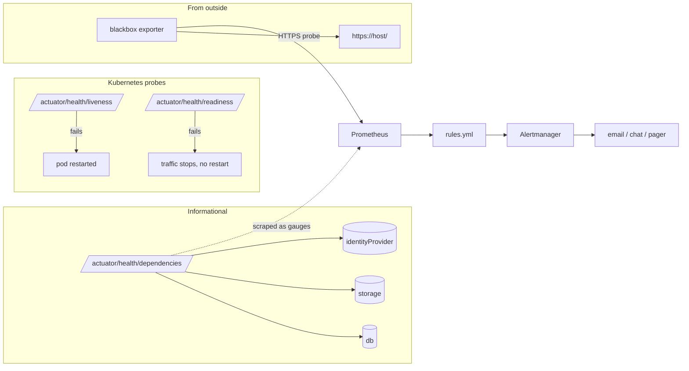

# Health monitoring

What "healthy" means for AssetCare, how it is measured, who is told, and what to open when something is not.

## 1. The health model

| Signal | Endpoint or source | Meaning when it fails | Automatic reaction |
|---|---|---|---|
| liveness | `/actuator/health/liveness` | the JVM is wedged | Kubernetes restarts the pod |
| readiness | `/actuator/health/readiness` = `readinessState` + `db` | cannot serve requests correctly | traffic is withheld until it recovers |
| dependencies | `/actuator/health/dependencies` = `db`, `storage`, `identityProvider` | one dependency is degraded | none; alert only. A storage outage breaks uploads, an IdP outage breaks new logins, the rest keeps working |
| build | `/actuator/info` | which version and commit is running | none; `scripts/health.sh` prints it |
| external reachability | blackbox probe of `https://<host>/` and `/api/actuator/health/liveness` | DNS, TLS, ingress or the pod is broken as seen by a user | alert `AssetCareEndpointDown` |
| metrics | `/actuator/prometheus` | request rate, errors, latency, JVM, pool, business counters | alerts below |
| logs | JSON on stdout → Loki | every line has `requestId`, `traceId`, `user` | search by request id |
| traces | OTLP → Tempo | where time went inside a request | linked from the log line |
| audit | `audit_event` table | what changed, by whom, with the request id | queryable through the API |

## 2. Service level objectives

Measured over 30 days on the Grafana "AssetCare overview" dashboard; the alerts fire on the short-term burn.

| SLO | Target | Indicator |
|---|---|---|
| Availability | 99.5 % (3.6 h per month) | successful blackbox probes / all probes |
| Read latency | 95 % of `GET /api/v1/**` under 300 ms | `http_server_requests_seconds` histogram |
| Write latency | 95 % of writes under 800 ms | same, by method |
| Error rate | < 1 % 5xx of all requests | `status=~"5.."` / all |
| Backup freshness | a successful dump every 24 h | CronJob `lastSuccessfulTime` |

The single free VM has no SLA. These are the targets the *application* is built to meet; the platform beneath it
(one node, no HA database) is the reason the availability target is 99.5 and not 99.95. `docs/PRODUCTION-GAPS.md`.

## 3. Alerts and where they lead

Every alert in `observability/prometheus/rules.yml` has a `runbook` annotation naming the section in
`docs/operations/RUNBOOK.md`. Severity `critical` pages; `warning` waits for working hours.

| Alert | Fires when | Severity | Runbook section |
|---|---|---|---|
| AssetCareEndpointDown | external probe fails for 3 min | critical | Certificate not issued / API pods restarting |
| AssetCareApiDown | no scrape target up for 2 min | critical | API pods restarting |
| AssetCareHigh5xxRate | > 2 % 5xx over 5 min | critical | Slow requests / a single failing request |
| AssetCareP95LatencyHigh | p95 > 1 s over 10 min | warning | Slow requests |
| AssetCareDbPoolNearlyExhausted | > 80 % of the pool busy for 5 min | warning | Slow requests (database) |
| AssetCareDbConnectionsPending | threads waiting for a connection | warning | Slow requests (database) |
| AssetCareJvmHeapHigh | > 90 % heap after GC for 10 min | warning | API pods restarting (OOM) |
| AssetCarePodRestarting | > 3 restarts in 1 h | warning | API pods restarting |
| AssetCareVolumeNearlyFull | PVC > 85 % | warning | Disk full |
| AssetCareDependencyDown | `storage` or `identityProvider` DOWN for 5 min | warning | Attachments failing / 401 for everyone |
| AssetCareBackupStale | no successful backup for 30 h | critical | Backups (BACKUP-RESTORE.md) |
| AssetCareCertificateExpiringSoon | TLS certificate expires within 14 days | warning | Certificate not issued |

## 4. Notification routing

Local: `observability/alertmanager/alertmanager.yaml` routes everything to a webhook receiver you can point at
anything (a `curl`-able endpoint, an ntfy topic, a Slack incoming webhook). Replace the placeholder URL and, for
email, fill the `smtp` block. Kubernetes: the same routes in `deploy/helm/observability/kube-prometheus-stack.yaml`
under `alertmanager.config`. Inhibition: when `AssetCareApiDown` fires, the latency and error alerts are silenced so one
outage is one page.

Test the chain end to end: `curl -XPOST localhost:9093/api/v2/alerts -d '[{"labels":{"alertname":"Test","severity":"warning"}}]'`
and confirm the message arrives.

## 5. Daily and weekly

| When | What | How |
|---|---|---|
| any time | is it healthy right now | `scripts/health.sh` (local) / `scripts/health.sh k8s assetcare` |
| after every deploy | nothing regressed | `scripts/smoke-test.sh`, then the dashboard for fifteen minutes |
| daily (automated) | backup ran | `AssetCareBackupStale` stays silent |
| weekly | dependency updates | Dependabot PRs; CI is the gate |
| weekly | security scans | `security.yml` on schedule; GitHub Security tab |
| monthly | restore drill | `BACKUP-RESTORE.md`; note the time it took in the runbook |
| quarterly | certificate and secret rotation review | `kubectl get certificate`; RUNBOOK "Rotate a secret" |

## 6. What to add when the product grows

- A second node: `PodDisruptionBudget` for the API and Keycloak, anti-affinity, and the HPA (`api.autoscaling`).
- A status page: point Grafana's public dashboard or a hosted status page at the blackbox probe metric.
- Error tracking in the SPA: `frontend/src/app/core/error-handler.ts` logs to the console; wire it to Sentry or an
  endpoint when there are users you cannot ask for their console.
- Synthetic login: a Playwright job on a schedule against production (`make e2e` with `E2E_BASE_URL`), the only check
  that proves Keycloak, the API and the SPA together.
